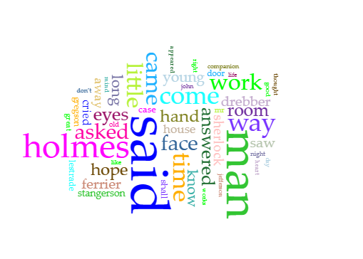
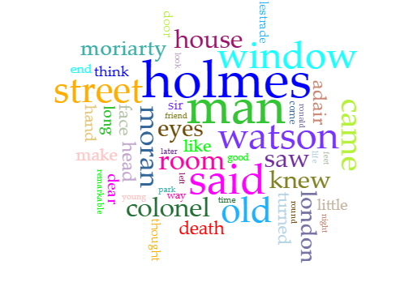
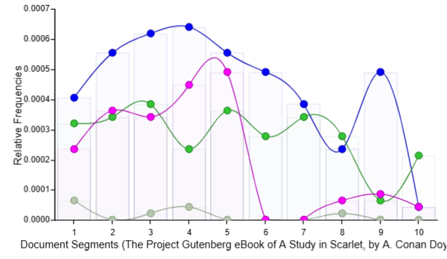
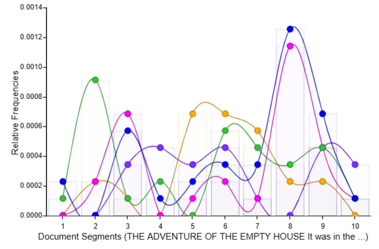

Experimental Lab Report

By Aiyenigba Bolu

6675334

IASC 2P02

Professor Aaron Mauro

# Abstract

This study questions whether an author can be fingerprinted through the deformation of their work. Deformation is a process by itself and can be considered both an interpretation and something to be interpreted (Samuels, 1999). This study asks if the original work's author can be fingerprinted through the newly created variation. This study uses two stories about Sherlock Holmes written by Sir Arthur Conan Doyle. These two stories are then run through the web-based analysis tool, Voyant. The resulting cirrus and trends are similar despite the time gap between the texts' publication and their differing plots.

# Introduction

The literary examination of a piece of work is an in-depth process that takes time and focus. The method of such literary interpretations is usually defined by close reading. Close reading refers to the act of reading a piece of literature to notice details and connections and form a cohesive theme or idea around these details. The article or idea discussed this way is usually discovered after reading the literature multiple times and examining the notes taken. Samuels (1999) discusses the process of deforming a piece of literature and using that new creation to explore the original work. The issue with close reading is that spending so much time with a work of literature might leave the reader dulled to certain aspects of the work. The idea behind deformation is to break apart the intended literature and put it back together to allow the reader to observe it from a new perspective. This study seeks to examine how an author's style presents itself through the course of their life through Voyant. An author's style should be evident regardless of the state of their work, deformed or otherwise. Through Voyant, this study will analyze how an author's style changes through the years and what elements stay the same. Also, the features that remain the same will be discussed after the results of the study are revealed. Breaking down a piece of literature should provide enough details and specific information in order for a reader to fingerprint the author.

# Methods

The process began by selecting two stories from the same author about the same character from two different points in the author's life. Using the Gutenberg database, the stories were "A Study in Scarlet" and "The Adventure of the Empty House." The author of these two stories is Sir Arthur Conan Doyle, written in 1886 and 1903, respectively. Both stories feature the character of Sherlock Holmes and follow the same genre conventions as we know them today. The first text was the first Sherlock Holmes' story written by the author while the second is the last. Voyant is the primary tool used in this study. It is a web-based analysis and reading tool for digital texts. Voyant is the "deformation" tool this study will use to examine the two texts. Both texts were entered into the website, Voyant and the tool's analysis of the texts was produced. Specific terms that were irrelevant to this study had to be removed from the data results of the tool's investigation, such as "gutenberg," which is the site of the stories' online publication. The cirrus for both literary works was produced in this manner. Cirrus refers to a word cloud of frequently appearing words in a text. The trends tab for the stories was created by adding the terms "holmes," "watson," "said," and "man." The resulting line and bar graphs were then collected and compared. The cirrus for both texts were similarly compared for similarities and differences.

# Results

The first cirrus hereby referred to as C-A is the cirrus of "A Study of Scarlet" while the second cirrus, C-B is of "The Adventure of the Empty House." Looking at the results, we can see that C-A and C-B both share words like "holmes," "Watson," and "Lestrade." These are names of recurring characters in the world of Sherlock Holmes. Verbs like "came," "saw," "knew," "asked," "answered," "think" and the titular "said" are used frequently enough to appear on the cirrus from both texts. Expressive body parts featured in both texts are "eyes," "hand," and "face." Interestingly enough, "house" and "door" feature prominently in both works. A preference for the adjectives "little" and "long" are also observable.

In T-A, "holmes" is pink, "Watson" is grey, "said" is blue and "man" is green. In T-B, "Watson" is purple, "said" is pink, "street" is orange, "man" is green and "holmes" is blue. In T-A, Watson has much lower relative frequency compared to Sherlock as opposed to the situation in T-B. Sherlock's frequency in T-A follows an odd pattern where his high frequency dips halfway through the story and never recovers. On the other hand, in T-B, Sherlock has a more constant presence represented by risings and dips until the highest peak just before the end of the story. In T-A, "said" is a constant through the story while in T-B, it generally follows Sherlock's highs and lows. T-A had "man" at a constant middle of the pack position. In T-B however, "man" has an early peak but dips and eventually recovers to a middle of the graph position.

# Discussion

C-A and C-B both contain the names of recurring characters in the series. This similarity marks both texts as being about the same general characters. Another similarity is the verb usage, which indicates the genre and style of the stories. Verbs like "said," "asked," "answered," and "think" show that the majority of both stories consists of characters talking to one another. The appearance of nouns like "door," "room," and "house" and verbs like "came" and "come" indicates the limited setting of the stories. The appearance of expressive body parts in the cirrus, such as "eyes," "face," and "hand," suggest that the stories place importance on the characters' expressions. It is possible to interpret this as both texts taking place mostly indoors. Across both stories, these general basics do not change, as seen from their cirrus. If we combine these elements, the cirrus presents a tale set indoors where characters talk and react to each other's statements. This is the general trend of the Arthur Doyle Sherlock stories.

T-A and T-B follow the same trend of heavy dialogue, but we can start to interpret their more specific meanings. For instance, Watson in the first story has a much less developed character than the version in the second. This difference is because the first story is the first Sherlock story, and the second is the last one. This difference can be seen in the difference in "holmes" between T-A and T-B. Where T-A has an odder graph, T-B follows what is now standard detective literary trends. T-B has "holmes" and, "said" reach their peak at what is the "final deduction" point of the story. The "final deduction" is the part where the detective explains the actual events of the mystery or crime to his audience and the readers. Another instance is the early peak of T-B's "man" as opposed to T-A's middling "man." The early height is the result of the author introducing characters and then proceeding to name them, which results in the dip we see for the rest of the story.

So far, we have seen that when texts are deformed, the author can be fingerprinted through their choice of words and when they use them. The differences in the cirrus can be attributed to the different plots between stories, as certain characters and locations are specific to each text. The difference between trends (graphs) can be attributed to the author developing a consistent style and evolving his skill. "A Study of Scarlet" and "The Adventure of the Empty House" are published with a seventeen-year time gap between them. The fact that there is so much consistency between the two texts suggests that authors can be fingerprinted through deformed versions of their work.

# References

Owen Dudley Edwards, "Doyle, Sir Arthur Ignatius Conan (1859–1930)", _Oxford Dictionary of National Biography_, Oxford University Press, 2004.

Samuels, L., & McGann, J. (1999). Deformance and Interpretation. _New Literary History_, _30_(1), 25–56. http://www.jstor.org/stable/20057521